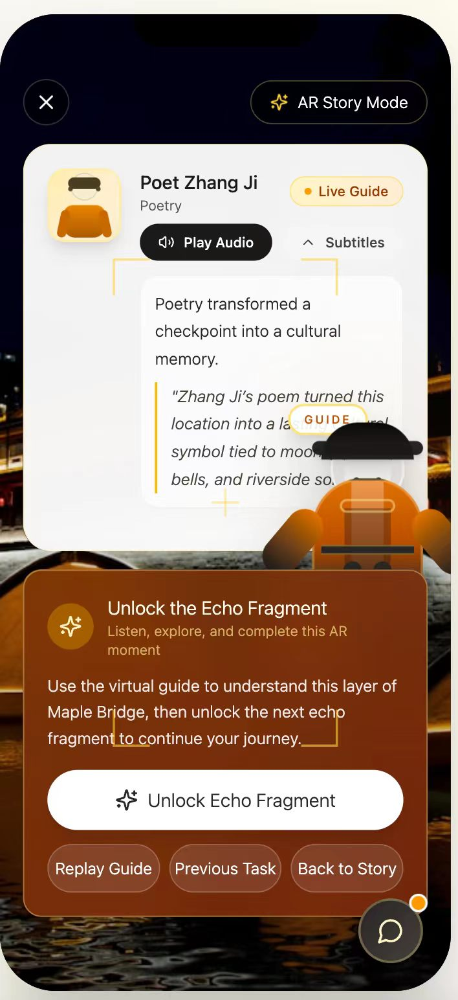
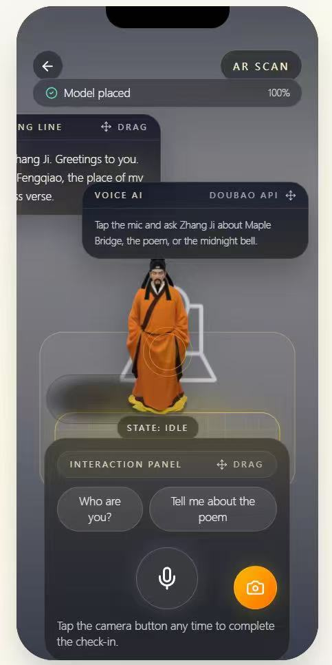

# 5. Evaluation & Reflection

## 5.1 Evaluation Evidence

The poster provides aggregate participant evidence rather than individual verbatim quotes. It reports a participant group of 35 people:

- 20 international tourists
- 11 domestic tourists
- 4 local residents

For the coursework alpha usability test, we also checked the prototype flow with 3 users:

- User 1: international tourist
- User 2: domestic visitor
- User 3: local student

Each user completed the same route-based task flow: Home Entry -> Map Preview -> Guided Route -> AR Scan -> AI Guide -> Moments -> Echoes Summary -> Ranking. We collected evidence through observation, task-completion notes, verbal feedback, and short rating questions.

## 5.2 Poster-Based User Feedback

The poster identifies the main user problems in traditional heritage site visits through Figure 1:

| Pain point | Average severity rating |
|---|---:|
| Limited interaction | 4.57 |
| Low immersion | 4.43 |
| Lack of memorability | 4.43 |
| Passive tour flow | 4.31 |
| Passive information reception | 4.03 |
| Over-reliance on text | 3.89 |
| Unclear focus during visits | 3.46 |

These results show that the strongest user problem was not only information access, but the lack of active, immersive interaction.

Figure 3 also supports the final design direction. Among 35 participants, 23 preferred the selected concept: a playful AR experience with AI dialogue and fragment collection. This was higher than the static story guide and AR narrative guide alternatives.

## 5.3 Key Prototype Evaluation Results

The poster-level evaluation summary reported generally positive acceptance:

| Measure | Score |
|---|---:|
| Aesthetics | 4.54 |
| Value | 4.23 |
| Engagement | 4.00 |
| Education | 3.94 |
| Usability | 3.89 |
| Overall Acceptance | 4.60 |
| Willingness to Recommend | 4.29 |
| Perceived Attractiveness | 4.29 |

These results suggest that the concept was attractive and acceptable, while usability was the lowest of the reported prototype experience ratings. The poster does not state a separate sample size for Figures 4 and 5, so this portfolio treats them as poster-level aggregated evaluation results.

## 5.4 Iterative Refinement

| Feedback / Problem | Evidence | Design Change | Before | After |
|---|---|---|---|---|
| Heritage visits needed stronger interaction and immersion. | Figure 1 rated limited interaction 4.57 and low immersion 4.43. Figure 3 showed that 23/35 participants preferred the AR + AI + fragment concept. | The revised screen makes the AR scan state, voice AI guide, and task feedback more visible in the same interface. |  |  |

This was the main visual iteration because the AR/AI screen is the point where passive viewing becomes active cultural exploration. The refined screen makes the scan state, AI support, and interaction feedback clearer, directly responding to the poster's evidence that users wanted stronger interaction and immersion.

## 5.5 Design Implications

- Clearer AR and AI entry points support the poster finding that limited interaction was the strongest pain point.
- Combining scan feedback and AI support in the same screen makes the interaction feel more immediate and less fragmented.
- Visible task feedback helps the fragment-collection mechanic feel like a reward rather than a hidden system state.
- The iteration supports international and first-time visitors because they need stronger interface cues when using unfamiliar heritage content.

## 5.6 Social & Ethical Reflection

The project makes Suzhou Maple Bridge's poetry and canal culture more accessible to young people and international visitors through lightweight AR and AI interaction. Instead of relying only on static text boards, the concept turns cultural interpretation into a guided, visual, and question-based experience.

The design also raises privacy and consent issues. The system should use real-time location only for on-site route guidance and should avoid permanent storage of personal location data. Camera-based interaction and shared moments should require clear user permission before any photo is saved or uploaded.

## 5.7 AI Application Reflection

Generative AI supports personalised storytelling and free question answering, which helps visitors move beyond fixed scripts. However, AI-generated cultural explanations must be bounded by verified site knowledge, reviewed for historical accuracy, and presented as guided interpretation rather than unquestionable truth.

AI was also used during portfolio production to help refine writing, structure the static website, and check consistency against the provided project materials. The team should still treat the design rationale, evaluation evidence, and cultural claims as human-reviewed project work.
