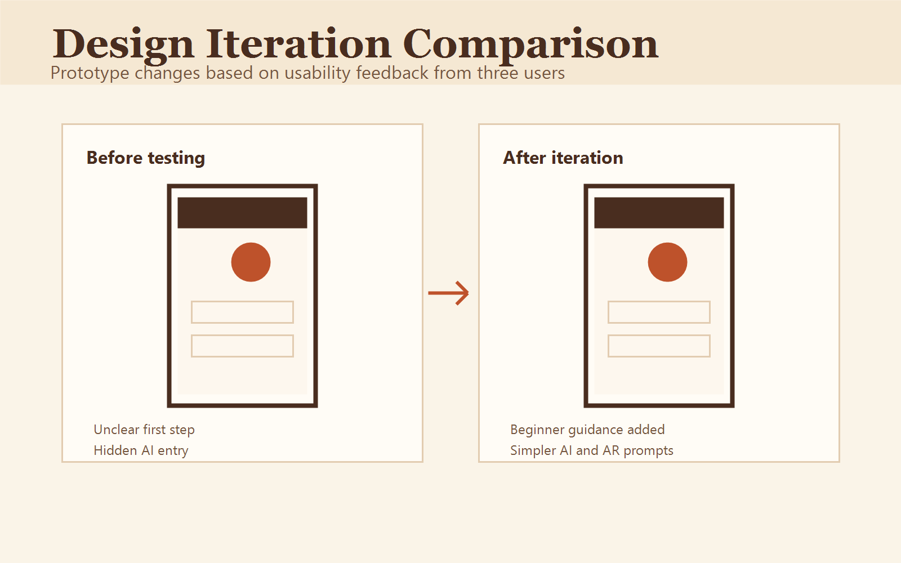

# 5. Evaluation & Reflection

## 5.1 Usability Testing with Alpha Version
We conducted usability testing with 3 real users to evaluate the prototype:
- User 1: International tourist 
- User 2: Domestic visitor 
- User 3: Local student 

Each user completed the full process including home entry, map preview, guided route, AR interaction, AI guide, moments, fragment summary, and ranking. We recorded their behaviour, feedback and subjective experience.

## 5.2 Key User Feedback
- Users highly praised the combination of AR scene restoration and real-site visiting, which greatly improved immersion.
- AI storytelling was considered friendly, easy to understand and suitable for different age groups.
- The fragment collection and leaderboard successfully increased willingness to explore continuously.
- Some users suggested adding clearer navigation hints at the beginning.
- International users hoped for more complete English explanation and multilingual AR subtitles.

## 5.3 Design Iteration & Improvement
Based on testing feedback, we optimized the following aspects:
- Added intuitive beginner guidance to reduce operation confusion.
- Optimized AR trigger sensitivity to adapt to complex outdoor GPS environment.
- Simplified AI dialogue entry to make it easier for users to ask questions.
- Enhanced multilingual text and subtitle support for international visitors.

*Interface and interaction optimization before and after user testing*

## 5.4 Social & Ethical Reflection
The project makes Suzhou Maple Bridge’s poetry and canal culture more accessible to young people and international visitors through lightweight AR and AI interaction. It transforms boring text introduction into vivid, experiential cultural education.

We strictly protected user privacy: the system only uses real-time location for on-site triggering and does not store personal location data permanently. No private photo data is uploaded without user permission.

## 5.5 AI Application Reflection
Generative AI plays a core role in personalized storytelling and free question answering. It avoids rigid fixed scripts and provides adaptive content for both casual tourists and in-depth learners. It greatly reduces the cost of manual script writing while maintaining cultural accuracy and logical consistency.

Overall, the project successfully realised a playful, immersive AR-AI interactive system for outdoor heritage sites, solving traditional sightseeing pain points and providing a replicable reference for future cultural tourism design.
