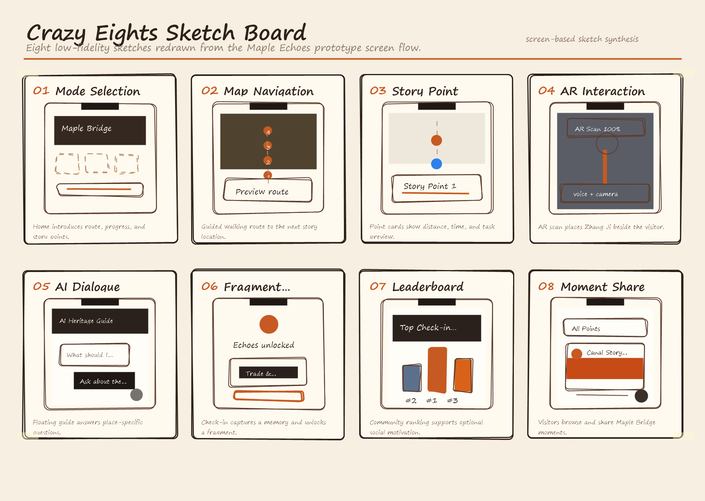

# 3. Ideation & Alternatives

---

## 3.1 Crazy Eights & Initial Brainstorming
To quickly explore design directions for Maple Echoes, we used the Crazy Eights method to sketch 8 different concepts in a short session. The sketches covered various ideas for:
- Location-based story points and map navigation
- AR interaction styles (historical overlays, character animations, photo tasks)
- AI dialogue interfaces and storytelling formats
- Gamified progression and fragment collection mechanics

These quick iterations helped us identify the most engaging combinations of AR, AI, and gamification for one continuous guided visit.

*Hand-drawn sketch board redrawn from the prototype screen flow*

---

## 3.2 Design Alternatives Comparison
As shown in our poster’s design decision analysis, we compared three distinct concepts to select the most effective solution:

### Concept A: Static Story Guide
- **Core Idea**: A simple, map-based guide with pre-written text and photos for each story point.
- **Pros**: Easy to build, low technical complexity, works on all devices.
- **Cons**: Passive experience with no interaction, no personalization, low engagement and memorability.

### Concept B: AR Narrative Guide
- **Core Idea**: A location-based AR-only experience, with historical overlays and visual reconstructions.
- **Pros**: Strong visual immersion through AR, appealing photo opportunities.
- **Cons**: No AI dialogue or personalized storytelling, no gamified progression, high dependency on device performance.

### Concept C: Playful AR Experience with AI Dialogue & Fragment Collection (Final Design)
- **Core Idea**: The design we chose, combining interactive map navigation, AR overlays, conversational AI, photo check-in tasks, and a fragment collection system.
- **Pros**:
  1.  Combines location-based triggers, AR interaction, and personalized AI storytelling.
  2.  Gamified progression with fragment collection and a leaderboard keeps users motivated.
  3.  AI follow-up questions allow visitors to access deeper cultural context without an extra decision step.
  4.  Supports active participation through photo tasks and shareable achievements.
- **Cons**: Requires more development effort for AR/AI integration and gamification mechanics.

Based on participant preference testing (as shown in our poster’s bar chart), **Concept C** received the strongest preference and was selected as our final direction.

---

## 3.3 Low-Fidelity Prototype & Iteration
We created a clickable low-fidelity prototype in Figma to test the core user flow, interaction logic, and screen transitions. The updated prototype follows the full journey from home entry to ranking:

1.  **Home Entry**: Route promise, time estimate, progress state, and start exploration action
2.  **Map Preview**: Four story points and the next destination along the Maple Bridge route
3.  **Guided Route**: Walking distance, estimated time, and start-story prompt
4.  **AR Scan**: Zhang Ji AR interaction, voice AI panel, and check-in camera action
5.  **AI Guide**: Conversational explanation for the canal, bridge, and poem
6.  **Moments**: Community photo moments and share action
7.  **Echoes Summary**: Captured moment, fragment unlock, and progress feedback
8.  **Ranking**: Community challenge board for optional comparison and continued exploration

Through iterative testing of the prototype, we refined key flows:
- Added clearer onboarding guidance to reduce confusion at the start
- Improved the AR/AI trigger feedback to make interactions more responsive
- Simplified the fragment unlock animation for better user feedback

- Figma Prototype Link: [Click here to open the prototype](https://www.figma.com/make/c0dRs2buy6AqLNbdvQpPdl/Cultural-Heritage-Experience-Wireframe?p=f&t=2d0sT2ezjjVFXTE7-0)

---

## 3.4 Key Design Decisions & Rationale
- **Why we simplified the entry flow**: To make the first step faster and keep every visitor on one clear route, while still supporting deeper inquiry through the AI guide.
- **Why we integrated both AR and AI**: AR provides visual immersion and photo opportunities, while AI enables personalized, adaptive storytelling.
- **Why we chose fragment collection as the core mechanic**: It creates a clear progression path, encourages exploration, and provides shareable, memorable rewards.
