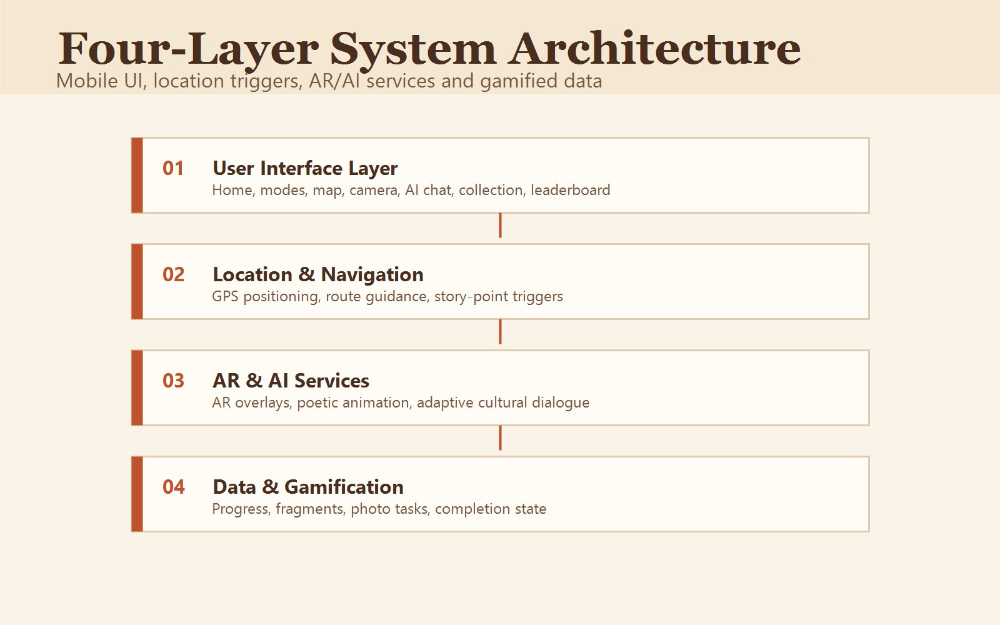

# 4. Technical Implementation

## 4.1 System Overview
Our project **Maple Echoes** is an on-site interactive heritage system designed for Suzhou Maple Bridge. It integrates **location-based map navigation, AR visual overlay, AI conversational storytelling, photo check-in tasks, and cultural fragment collection**.

The system supports one continuous guided route while still allowing visitors to ask deeper AI follow-up questions when they want more context.

## 4.2 System Architecture
The whole system is divided into four core layers:

1. **User Interface Layer**
Mobile-first interactive interface including home entry, map preview, guided route, AR camera view, AI dialogue window, moments, fragment summary and ranking page.

2. **Location & Navigation Layer**
Provides real-time GPS positioning, outdoor site route guidance, and automatic trigger when users reach designated cultural story points.

3. **AR & AI Service Layer**
- AR module renders historical scene overlay and poetic animation on real camera view.
- Generative AI supports natural language conversation and adaptive story explanation during the guided route.

4. **Data & Gamification Layer**
Stores user exploration progress, collected cultural fragments, photo records, and leaderboard data to support gamified motivation and social sharing.

## 4.3 Core Function Implementation
### Map & Location Trigger
Interactive map marks all cultural nodes of Maple Bridge. The system automatically detects user location and unlocks corresponding AR and storytelling content when entering the effective range.

### AR Historical Restoration
When users stand at key landmarks, AR reconstructs ancient bridge scenery and poetic scenes, allowing visitors to compare past and present views visually.

### AI Interactive Dialogue
AI acts as a cultural narrator. Users can ask historical, poetic and canal-related questions freely, and the AI adjusts explanation depth based on the question and route context.

### Photo Check-in & Fragment Collection
Users complete on-site photo tasks at each spot to unlock exclusive cultural fragments. Collected fragments can be viewed in the gallery and shared on social platforms.

### Leaderboard Mechanism
The system records user exploration completion rate and collected fragments, displaying rankings to encourage further engagement.

## 4.4 Team Roles & Contributions
- **Chenyu Zhu (2361550)**: Responsible for user research, persona modelling, user journey map, pain point analysis, literature review, website framework building and all document writing for GitHub portfolio.
- **Yuan Xu (2363085)**: Responsible for UI visual design, interface layout, poster production and low-fidelity prototype styling.
- **Yuhan Gao (2359858)**: Responsible for system architecture design, AR effect logic, map navigation and technical prototype development.
- **Hanjun Zheng (2360088)**: Responsible for project planning, requirement sorting, usability testing, feedback collection and project reflection.
