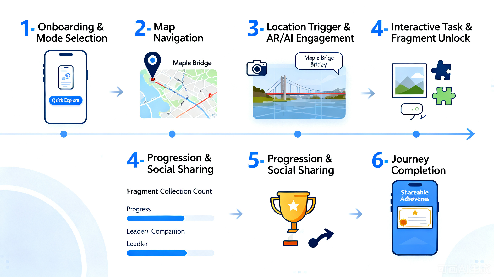
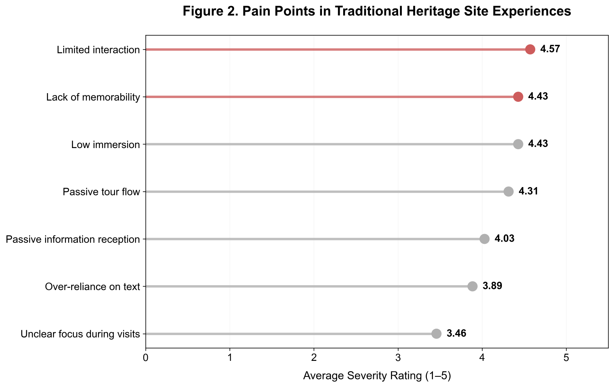
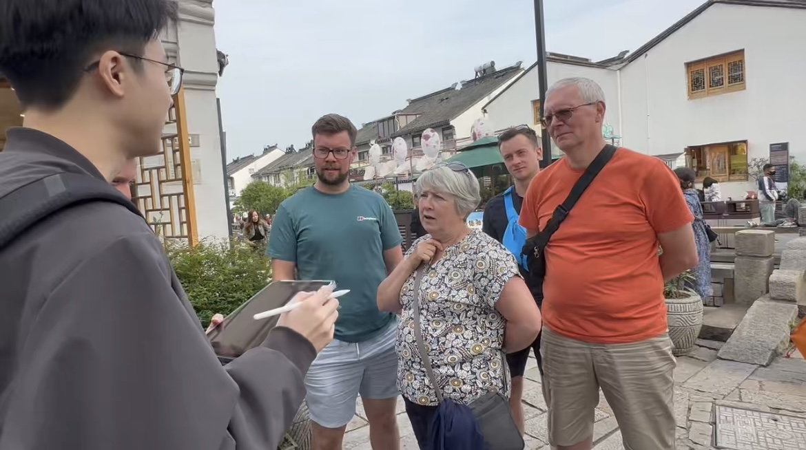
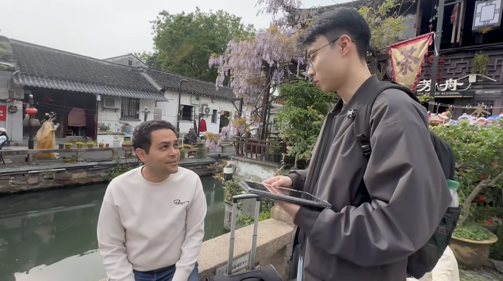

# 2. User Requirements

---

## 2.1 User Journey Map
The full user journey for a tourist using **Maple Echoes** is designed to transform passive sightseeing into an active, playful experience. It responds directly to the pain points shown in the poster and in the pain points map: confusing navigation, static text, low interactivity, lack of progress feedback, and one-size-fits-all content.

1.  **Onboarding & Mode Selection**
    User opens the app and chooses between Quick Explore (tourist) or Deep Explore (student) mode.
2.  **Map Navigation**
    Interactive map guides the user to the first story point at Maple Bridge.
3.  **Location Trigger & AR/AI Engagement**
    Upon arrival, the system triggers AR overlays and a short AI-generated story.
4.  **Interactive Task & Fragment Unlock**
    User completes a photo check-in or AR task to unlock a cultural fragment.
5.  **Progression & Social Sharing**
    User collects fragments, views their progress, and can compare scores on the leaderboard.
6.  **Journey Completion**
    After visiting all points, the user receives a summary of their exploration and shareable achievements.

*Pain-point-informed user journey flow of Maple Echoes, highlighting key interactions and touchpoints*

---

## 2.2 Pain Points Map
Key pain points in traditional heritage visits, identified through user interviews and field research:

*Summary of pain points in traditional heritage experiences*

- **Confusing navigation**: Visitors often get lost or miss key landmarks due to unclear signage.
- **Overwhelming static text**: Long, unstructured explanations are hard to read and process on-site.
- **Low interactivity**: Passive viewing fails to engage young visitors or create memorable experiences.
- **No immediate feedback**: Visitors get no sense of progress or reward during their visit.
- **One-size-fits-all content**: No differentiation between casual tourists and students seeking deeper learning.
- **Limited shareable moments**: Few opportunities to create content for social media.

---

## 2.3 Core Playful System Requirements
To address these pain points, the system must meet three core “playful” requirements:

1.  **Location-Based Exploration**
    The app uses real-time GPS to guide users to story points and trigger content automatically. This turns sightseeing into a treasure-hunt-like activity, encouraging exploration and movement.

2.  **Accessible Cultural Interpretation**
    AR overlays and conversational AI transform static text into visual, interactive storytelling. The content adapts to the user’s mode (Quick/Deep Explore), making history engaging and easy to understand for all ages.

3.  **Strong Interaction & Collection-Based Motivation**
    Photo check-in tasks, fragment collection, and a leaderboard system provide immediate feedback and a clear progression path. This gamification keeps users motivated to explore more and share their achievements.

---

## 2.4 Evidence of Life (Field Research & Interviews)
We conducted on-site observations and interviews with visitors at Suzhou Maple Bridge to validate our assumptions and pain points. The following photos document our field research:

*Interviewing a tourist about their experience with traditional heritage signage*

*Collecting feedback on common pain points during the visit*

*Talking with an international visitor about language and accessibility needs*

*Observing how visitors interact with static information boards*

*Group discussion with local students about their desire for deeper context*

All field research photos are stored in the `assets/images/field-research/` folder.
